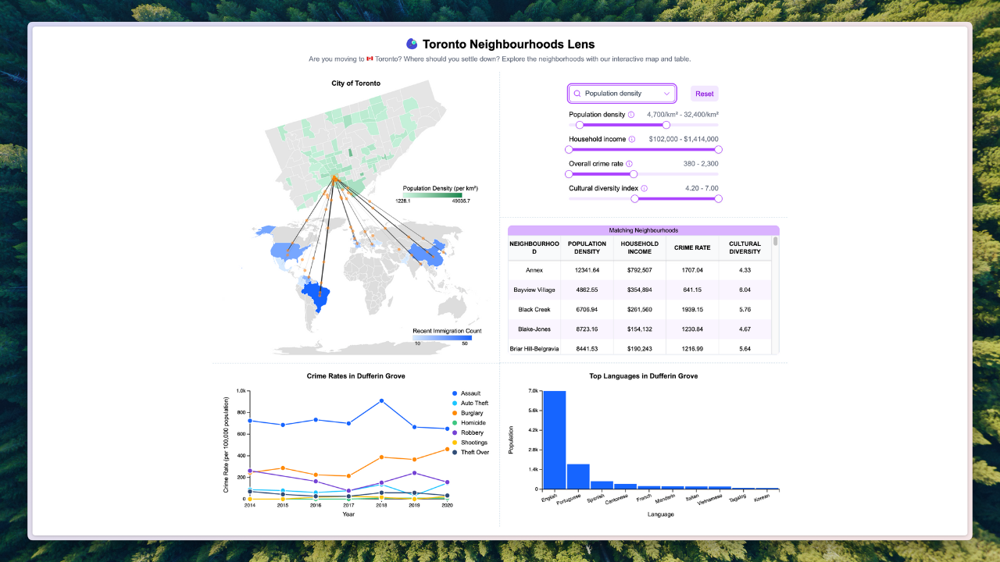

# CPSC447 Project

**Toronto Neighbourhood Lens (Phillip Qiao, Kuiliang Zhang, Cathryn Guo)** - D3 Visualization for UBC CPSC447

Are you moving to 🇨🇦 Toronto? Where should you settle down? Explore the neighborhoods with our
interactive map and table.



[Live Demo](https://pages.github.students.cs.ubc.ca/kzhang48/cpsc447-g15/)
[Rriginal UBC repo](https://github.students.cs.ubc.ca/CPSC447-2024W-T2/g15/tree/build)

## Install dependencies

Before developing or building the project, you need to install the dependencies.

```bash
pnpm install
```

We recommend using pnpm to install dependencies, but you can use npm or yarn as well (`npm install` or `yarn`).

## Developing

To run the development server, run the following command:

```bash
pnpm dev

# or start the server and open the app in a new browser tab
pnpm dev --open
```

To create a new commit, please follow the [Gitmoji Commit Message Convention](https://www.yuque.com/arvinxx-fe/workflow/gcm-v2) and [Conventional Commits](https://www.conventionalcommits.org/en/v1.0.0/).

## Building

To create a production version of your app:

```bash
pnpm build
```

You can preview the production build with `pnpm preview`.

## How to find the index.html entry point

After running `pnpm build`, you can find the index.html entry point in the `build` folder.

You can use VSCode Live Server extension to view the website or deploy it.

Please note that if you are using VSCode Live Server to view the website, you should open the `build` folder as the root directory in VSCode. Otherwise, Live Server will consider the parent directory as the root, which may result in incorrect paths, such as faulty image links.

<!-- ## TA: Please Read This

> [!CAUTION]
> Caution -->

<!-- ## How to deploy

```bash
pnpm gh-pages
```

Currently, only Kuiliang Zhang has the access to deploy the website, as the script is configured to push to his GitHub Pages.

> To deploy your app, you may need to install an [adapter](https://svelte.dev/docs/kit/adapters) for your target environment. We use static adapter for this project. -->
